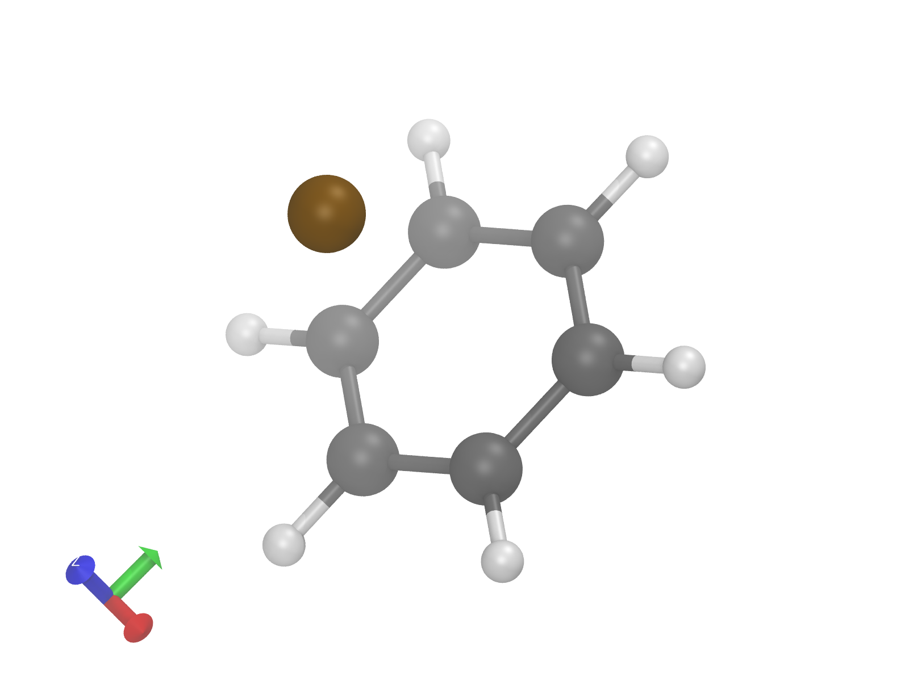

<h1 align='center'>
London Dispersion Density (LDD) Suite
</h1>

[](https://github.com/bistonigroup)
[](https://x.com/BistoniGroup)
[](https://giovannibistoni.wordpress.com/)
[](https://www.python.org/download/releases/3.0/)
[](https://www.gnu.org/licenses/lgpl-3.0)

The **LDD suite**  computes atomic contributions to the London dispersion energy, the dispersion density, and its difference function. It is based on the [**Atomic Decomposition of London Dispersion energy (ADLD)**](https://pubs.acs.org/doi/full/10.1021/acscentsci.5c00356) method and includes the following tools:

- `lddensityd4.py`, `lddensityd3.py`, `lddensitydifference.py` – computes atomic dispersion contributions using different correction models and the London dispersion density function.
- `PubQualityVMD.tcl` – generates publication-quality images in VMD and visualizes atomic contributions.
- `CubeGenerator.py` – creates a _.cube_ file for visualization when atomic contributions are computed with another software.

## Table of contents
- [ Tools Description ](#tools-description)
- [ Requirements ](#requirements)
- [ Usage ](#usage)
- [ Arguments Description ](#arguments-description)
- [ Example Images ](#example-images)
- [ Credits ](#credits)
- [ License ](#license)
- [ Contact ](#contact)

## Tools Description

### _lddensityd3.py_ and _lddensityd4.py_
These Python scripts are designed to compute atomic contributions to the London dispersion energy and the London dispersion density function, relying on D3 and D4 corrections, respectively.

- **Input**: 
  - `{basename}.xyz` : a classic _.xyz_ file containing atomic coordinates of the system in ångström. 
- **Output**:
  - `.d3atomwise.txt` or `.d4atomwise.txt` : a file containing atomic coordinates of the system with an additional column indicating each atom contribution to the London dispersion energy.
  - `.d3out.txt` or `.d4out.txt` : the original output generated by Grimme's DFT-D3 or DFT-D4 executable, respectively.
  - `.d3omega.cube` or `.d4omega.cube` : a _.cube_ file that stores volumetric data of the LDD function, which can be used to easily visualize atomic contributions to London dispersion.

---
### _lddensitydifference.py_
This script computes the LDD difference function, which can be used to easily visualize the difference between atomic LD contributions for two different molecular structures (e.g., a pair of structures along a reaction profile).

- **Input**:
  - `{basename}.atomwise.txt` : a file containing atomic coordinates in the _.xyz_ format and in the 5th column the differences of the atomic London dispersion energies.
- **Output**:
  - `{basename}.omega.cube`: the LDD difference function in _.cube_ format.

---
### _PubQualityVMD.tcl_
This script is designed mainly to visualize LD density (difference) function from a _.cube_ file, but it also allows you to load an _.xyz_ file to view a molecule structure. The script adjusts VMD settings to generate publication-quality images.
Additionally, it includes an improved pick event feature that displays atomic contributions to dispersion energy in the terminal, extracted from the `{basename}.atomwise.txt` file.

## Requirements
- For `lddensityd4.py` and `lddensityd3.py`, ensure that _.xyz_ file and the respective DFT-D3 or DFT-D4 executable are in the current path. The executable can be downloaded from the [official website](https://www.chemie.uni-bonn.de/grimme/de/software).
- For `lddensitydifference.py`, ensure `{basename}.atomwise.txt` is in the current path.
- To use `PubQualityVMD.tcl` you must have VMD installed on your computer. VMD can be downloaded from the [official website](https://www.ks.uiuc.edu/Research/vmd/).
- Python 3.x with standard libraries.

## Usage

### _lddensityd3.py_ and _lddensityd4.py_

1. Ensure `{basename}.xyz` file is at the current path.
2. Run the script:
- For `lddensityd3.py`:

    <pre><code style="font-size: 13px;">python3 lddensityd3.py &lt;basename&gt; [-h] [--npoints NP] [--func FUNC] [--damp DAMP] [--nprocs NPROCS]</code></pre>
    
- For `lddensityd4.py`:

  <pre><code style="font-size: 13px;">python3 lddensityd4.py &lt;basename&gt; [-h] [--npoints NP] [--func FUNC] [--charge CHARGE] [--s9 S9] [--nprocs NPROCS]</code></pre>

---
### _lddensitydifference.py_

1. Ensure `{basename}.atomwise.txt` file is at the current path.
2. Run the script:

    <pre><code style="font-size: 13px;">python3 lddensitydifference.py &lt;basename&gt; [-h] [--npoints NP] [--nprocs NPROCS]</code></pre>

---
### _PubQualityVMD.tcl_
1. Ensure the input file (_.cube_ or _.xyz_) you wish to visualize is correctly named and located within an accessible directory (it's recommended to work within a single directory).
2. Modify the script to include the path name in `set file_name` command.
3. Run the script with the following command:

    <pre><code style="font-size: 13px;">vmd -e PubQualityVMD.tcl</code></pre>

When a _.cube_ file is loaded, if the `{basename}.atomwise.txt` file is present in the same folder, you can use the _pick_ feature in VMD (_Mouse_ > _Pick_) to visualize the dispersion energy of individual atoms upon selection.


> [!NOTE] 
> Some functions within the script are commented out by default for safety. However, if you are interested in exploring or utilizing these functions, you can easily uncomment them. \
> Auto color scaling is enabled by default. \
> Rendering is disabled by default. Set `render_mode` to `1` to enable it ([ImageMagick](https://imagemagick.org/script/download.php) is required for converting to _png_)

> [!TIP]
> Change the rotation angles (`rot_x`, `rot_y`, `rot_z`) and the moleculare size (`scale_val`) to display the molecule according to your preference.
> For better visualization, set `autoscale` to `1` and choose symmetric values for `colorscale_min` and `colorscale_max`.
 
### CubeGenerator.py
If you have already computed the atomic contributions using a different software and only need to generate the _.cube_ file, you can use the `CubeGenerator.py` script. This script requires an _.xyz_ file with an additional column containing the atomic dispersion contributions in Hartree. The file should be named `{basename}.atomwise.txt`.

Use the following command to run the script:

<pre><code style="font-size: 13px;">python3 CubeGenerator.py &lt;basename&gt; [-h] [--npoints NPOINTS] [--nprocs NPROCS]</code></pre>

Below is an example of a `{basename}.atomwise.txt` file for the $C_6H_6–Li$ system:

```
#
# atom, x, y, z, Edisp(hartree)
C    -2.380042576     1.005478061    -0.088512194    -0.000180037
C    -2.320023031    -0.385743349    -0.095155325    -0.000180202
C    -1.086520436    -1.029047176    -0.156679445    -0.000180256
C     0.086838534    -0.281110527    -0.211595758    -0.000180108
C     0.026802041     1.110119772    -0.205245356    -0.000179804
C    -1.206705665     1.753411054    -0.143506979    -0.000179774
H    -3.33788079      1.505384199    -0.029750793    -3.62525E-05
H    -3.231265174    -0.966821147    -0.042233802    -3.63261E-05
H     0.939000704     1.691142987    -0.238205175    -3.61642E-05
H    -1.252959109     2.834353251    -0.129152596    -3.61451E-05
H    -1.039324501    -2.110034967    -0.151765984    -3.63413E-05
H     1.045670368    -0.781121982    -0.249470051    -3.62695E-05
Li   -1.016809019     0.350990152     2.549158632    -0.00129768
```

## Arguments Description

Below is a detailed table of the arguments that can be used with our script. Each entry provides you with the name of the argument, a brief description, information on whether the argument is optional, and the default value it takes if not specified by the user. This table is designed to help you quickly understand how to configure the script to meet your specific requirements.

| Argument  | Description | Optional | Default Value |
|-----------|-------------|----------|---------------|
| ***basename*** | The base name for the input _.xyz_ file. | No | *None* |
| ***npoints*** | Specifies the number of grid points for each dimension in the density calculation. | Yes | 80 |
| ***func***    | Defines the functional to be used in the calculation. Refer to [DFT-D3](https://www.chemie.uni-bonn.de/grimme/de/software/dft-d3/man.pdf)/[DFT-D4](https://github.com/dftd4/dftd4/tree/main) manual for all available functionals. | Yes | `b3-lyp` |
| ***damp***    | Specifies the damping function to be used in the D3 calculation, refer to [DT-D3 manual](https://www.chemie.uni-bonn.de/grimme/de/software/dft-d3/man.pdf) for all available damping functions. | Yes | `bj` |
| ***charge***  | Sets the overall charge of the molecule being analyzed in the D4 calculation. | Yes | 0 |
| ***s9***      | A coefficient that scale the ATM (Axilrod-Teller-Muto) term for three-body dispersion in the D4 calculation. Allows users to adjust the contribution of three-body interactions in the dispersion energy. Set to 0 to eliminate this contribution. | Yes | 0 |
| ***nprocs***  | Determines the number of processors used for parallel computation. | Yes | 1 |

## Example Images
The images displayed below are different visual representations of a Benzene-Lithium complex generated using the `PubQualityVMD.tcl` script. On the left, you can see the London dispersion density (_.cube_ file), while on the right the simple molecular structure (_.xyz_ file). Regarding LDD, red indicates high dispersion contribution, while blue indicates low contribution.

<p align="center">
  
   
</p>

## Credits
If you use the LDD suite in your research or any publication, please cite:
- **LDD suite GitHub repository**: \
[https://github.com/bistonigroup/LDDsuite](https://github.com/bistonigroup/LDDsuite)

- **ADLD paper** \
[https://pubs.acs.org/doi/full/10.1021/acscentsci.5c00356](https://pubs.acs.org/doi/full/10.1021/acscentsci.5c00356)

- **Original atomic decomposition method paper** \
[https://pubs.acs.org/doi/abs/10.1021/acs.jctc.3c00977](https://pubs.acs.org/doi/abs/10.1021/acs.jctc.3c00977)

## License
Distributed under GNU Lesser General Public License. See _LICENSE_ for more information.

## Contact
For general inquiries, feedback, or assistance with using the LDD suite, please contact us at:
 
[Gianluca Regni](https://scholar.google.com/citations?user=oHEU9VYAAAAJ&hl=it&oi=ao) - [_gianluca.regni@dottorandi.unipg.it_](mailto:gianluca.regni@dottorandi.unipg.it) \
[Lorenzo Baldinelli](https://scholar.google.com/citations?user=gsbh6tMAAAAJ&hl=it&oi=ao) - [_lorenzo.baldinelli@dottorandi.unipg.it_](mailto:lorenzo.baldinelli@dottorandi.unipg.it)   
[Giovanni Bistoni](https://scholar.google.com/citations?user=OfDkyicAAAAJ&hl=it&oi=ao) - [_giovanni.bistoni@unipg.it_](mailto:giovanni.bistoni@unipg.it)
