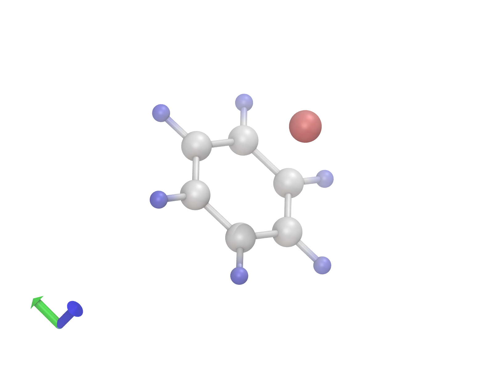

<h1 align='center'>
London Dispersion Density (LDD) Program Suite
</h1>

The LDD program suite is designed to compute atomic contributions to the London dispersion energy, the London dispersion density function, and the London dispersion density difference function. It includes the following tools: _lddensityd4.py_, _lddensityd3.py_, and _lddensitydifference.py_, each utilizing different dispersion corrections or computational approaches.
The suite includes a VMD (Visual Molecular Dynamics) script _PubQualityVMD.tcl_ to generate images suitable for scientific publications.

## Table of contents
- [ Tools Description ](#tools-description)
- [ Prerequisites ](#prerequisites)
- [ Usage ](#usage)
- [ Arguments Description ](#arguments-description)
- [ Example Images ](#example-images)
- [ Credits ](#credits)
- [ License ](#license)
- [ Contact ](#contact)

## Tools Description

### _lddensityd4.py_ and _lddensityd3.py_
These Python scripts are designed to compute atomic contributions to the London dispersion energy and the London dispersion density function. They utilize the D3 and D4 dispersion corrections, respectively.

- **Input**: 
  - `{basename}.xyz` : a file containing atomic coordinates in Ångström of the system
- **Output**:
  - `.d3atomwise.txt` or `.d4atomwise.txt` : Coordinates with an additional column indicating each atom's contribution to the London dispersion energy.
  - `.d3out.txt` or `.d4out.txt` : Original DFT-D3 or DFT-D4 output.
  - `.d3omega.cube` or `.d4omega.cube` : Spatial function for visualizing and analyzing dispersion energy contributions.

### _lddensitydifference.py_
This script computes the London Dispersion density difference function, providing insights into dispersion energy variations across different molecular structures (e.g., a pair of
structures along a reaction profile).

- **Input**:
  - `{basename}.atomwise.txt` : a file containing atomic coordinates and, as a 5th column, atomic LD energy differences.
- **Output**:
  - `{basename}.omega.cube`: the London dispersion density difference function in cube format.

### _PubQualityVMD.tcl_
This script is designed mainly to visualize LD density (difference) function from a .cube file, but you can load an _.xyz_ file to visualize a molecule structure as well. The script modifies the VMD settings so that it can generate publication-quality images.
Additionally, it includes a re-designed pick event feature that also displays atomic contributions to dispersion energy in the terminal, extracted from the _*atomwise.txt_ file.

## Prerequisites
- For _lddensityd4.py_ and _lddensityd3.py_, the respective DFT-D3 or DFT-D4 executable must be accessible at the specified path. These can be downloaded from their official websites ([official DFT-D3 website](https://www.chemie.uni-bonn.de/grimme/de/software/dft-d3/get_dft-d3) and [official DFT-D4 website](https://www.chemie.uni-bonn.de/grimme/de/software/dft-d4)).
- For _lddensitydifference.py_, ensure `{basename}.atomwise.txt` is in the current folder.
- To use _PubQualityVMD.tcl_ you must have VMD installed on your computer. VMD can be downloaded from the [official website](https://www.ks.uiuc.edu/Research/vmd/).
- Python 3.x with standard libraries.

## Usage

### _lddensityd3.py_ and _lddensityd4.py_

1. Ensure `{basename}.xyz` file is at specified path.
2. Run the script:
- For _lddensityd3.py_:

    <pre><code style="font-size: 13px;">python3 lddensityd3.py &lt;basename&gt; [--npoints NP] [--func FUNC] [--damp DAMP] [--nprocs NPROCS]</code></pre>
    
- For _lddensityd4.py_:

  <pre><code style="font-size: 13px;">python3 lddensityd4.py &lt;basename&gt; [--npoints NP] [--func FUNC] [--charge CHARGE] [--s9 S9] [--nprocs NPROCS]</code></pre>

### _lddensitydifference.py_

1. Ensure `{basename}.atomwise.txt` file is at specified path.
2. Run the script:

    <pre><code style="font-size: 13px;">python3 lddensitydifference.py &lt;basename&gt; [--npoints NP] [--nprocs NPROCS]</code></pre>

### _PubQualityVMD.tcl_
1. Ensure the input file (_.cube_ or _.xyz_) you wish to visualize is correctly named and located within an accessible directory.
2. Modify the script to include the correct file name in `set file_name` command.
3. Run the script with the following command:

    <pre><code style="font-size: 13px;">vmd -e PubQualityVMD.tcl</code></pre>

When both a _.cube_ file and the respective _*atomwise.txt_ file are present in the current folder, you can utilize the _pick_ feature of VMD (_Mouse_ > _Pick_) to visualize the dispersion energy of individual atoms upon selection.

> [!NOTE] 
> Some functions within the script are commented out by default. However, if you are interested in exploring or utilizing these functions, you can easily uncomment the relevant parts of the script.

> [!TIP]
> Use the _rotate_ and _scale_ commands in the _Rotation and Scaling_ section to display the molecule according to your preference.
 
## Arguments Description

Below is a detailed table of the arguments that can be used with our script. Each entry provides you with the name of the argument, a brief description, information on whether the argument is optional, and the default value it takes if not specified by the user. This table is designed to help you quickly understand how to configure the script to meet your specific requirements.

| Argument  | Description | Optional | Default Value |
|-----------|-------------|----------|---------------|
| ***basename*** | The base name for the input .xyz file. | No | *None* |
| ***npoints*** | Specifies the number of grid points for each dimension in the density calculation. | Yes | 80 |
| ***func***    | Defines the functional parameters used in the dispersion calculation. Refer to DFT-D3/DFT-D4 manual for all available functionals. | Yes | `b3-lyp` |
| ***damp***    | Specifies the damping scheme used in the D3 dispersion calculation, refer to DFT-D3 manual for all available damping functions. | Yes | `bj` |
| ***charge***  | Sets the overall charge of the molecule being analyzed in the D4 dispersion calculation. | Yes | 0 |
| ***s9***      | A coefficient that scale the ATM (Axilrod-Teller-Muto) term for three-body dispersion in the D4 dispersion calculation. Allows users to adjust the contribution of three-body interactions in the dispersion energy. Set to 0 to eliminate this contribution. | Yes | 0 |
| ***nprocs***  | Determines the number of processors used for parallel computation. Allows the script to utilize multiple cores for faster processing. | Yes | 1 |

## Example Images
The images displayed below are visual representations created using the _PubQualityVMD.tcl_ script.

- **Benzene-Lithium Complex:** the image on the left shows the London dispersion density for a Benzene-Lithium complex (_.cube_ file).
- **Water Molecule:** the image on the right illustrates a water molecule (_.xyz_ file).

  
   

## Credits
If you use the LDD program suite in your research or any publication, please cite the author(s).

## License
Distributed under the MIT License. See _LICENSE_ for more information.

## Contact
For general inquiries, feedback, or assistance with using the LDD program suite, please contact us at:

Gianluca Regni - [_gianluca.regni@studenti.unipg.it_](mailto:gianluca.regni@studenti.unipg.it)  
Lorenzo Baldinelli - [_lorenzo.baldinelli@studenti.unipg.it_](mailto:lorenzo.baldinelli@studenti.unipg.it)  
Giovanni Bistoni - [_giovanni.bistoni@unipg.it_](mailto:giovanni.bistoni@unipg.it) 
